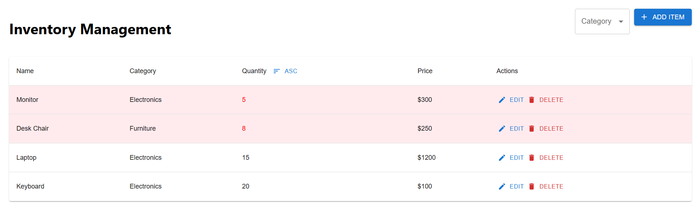
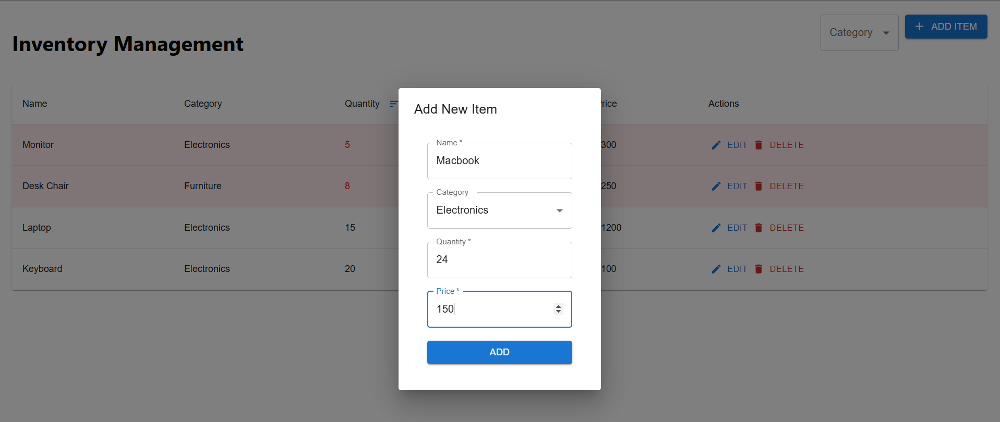

# Dynamic Inventory Management Table

A simple, feature-rich inventory management app built using **React.js**. This app displays a dynamic table of items in stock and allows users to manage their inventory with functionalities such as adding, editing, deleting, filtering, sorting, and highlighting low-stock items.

## Features

1. **Add Items**: Add new items to the inventory with fields such as name, category, and quantity.
2. **Edit Items**: Update details of existing items.
3. **Delete Items**: Remove items from the inventory.
4. **Filter by Category**: Filter items based on their category.
5. **Sort by Quantity**: Sort items in ascending or descending order of quantity.
6. **Highlight Low-Stock Items**: Automatically highlight items with a quantity below a specified threshold (e.g., 10).


## Getting Started

### Prerequisites

Ensure you have the following installed on your machine:

- [Node.js](https://nodejs.org/) (v14 or later)
- [npm](https://www.npmjs.com/) or [yarn](https://yarnpkg.com/)

### Installation

1. Clone the repository:
   ```bash
   git clone https://github.com/your-username/dynamic-inventory-table.git
   ```

2. Navigate to the project directory:
   ```bash
   cd dynamic-inventory-table
   ```

3. Install dependencies:
   ```bash
   npm install
   # or
   yarn install
   ```

### Running the App

1. Start the development server:
   ```bash
   npm start
   # or
   yarn start
   ```

2. Open your browser and navigate to `http://localhost:3000`.

### Building the App

To build the app for production:
```bash
npm run build
# or
yarn build
```

The production-ready files will be in the `build` directory.

## Folder Structure

```plaintext
inventory-management/
├── node_modules/        # Installed dependencies
├── public/              # Public assets
│   ├── favicon.ico
│   ├── index.html
│   ├── logo192.png
│   ├── logo512.png
│   ├── manifest.json
│   └── robots.txt
├── src/                 # Source files
│   ├── App.css          # Styles for the app
│   ├── App.js           # Main app component
│   ├── App.test.js      # Test file for App.js
│   ├── index.css        # Global styles
│   ├── index.js         # Entry point
│   ├── InventoryManagement.js # Core inventory management functionality
│   ├── logo.svg         # App logo
│   ├── reportWebVitals.js # Performance measuring
│   └── setupTests.js    # Setup for testing
├── .gitignore           # Files to ignore in Git
├── package-lock.json    # Dependency lockfile
├── package.json         # Project metadata and dependencies
└── README.md            # Documentation
```

## Usage

1. **Add an Item**:
   - Click the **Add Item** button.
   - Fill in the item details (name, category, quantity) and click **Submit**.

2. **Edit an Item**:
   - Click the **Edit** button next to an item in the table.
   - Update the item details in the modal and save the changes.

3. **Delete an Item**:
   - Click the **Delete** button next to an item to remove it from the inventory.

4. **Filter by Category**:
   - Use the dropdown to select a category and view items specific to that category.

5. **Sort by Quantity**:
   - Click on the **Quantity** column header to sort the items by quantity (ascending/descending).

6. **Highlight Low-Stock Items**:
   - Items with a quantity below 10 are automatically highlighted in the table.

## Screenshots


### Inventory Table



### Item Form



## Technologies Used

- **React.js**: Frontend library for building the user interface.
- **CSS/SCSS**: For styling the application.
- **React-Icons**: For icons used in the app.

## Contributing

Contributions are welcome! To contribute:

1. Fork the repository.
2. Create a new branch for your feature/fix:
   ```bash
   git checkout -b feature-name
   ```
3. Commit your changes:
   ```bash
   git commit -m "Add new feature"
   ```
4. Push to your branch:
   ```bash
   git push origin feature-name
   ```
5. Create a pull request.

## License

This project is licensed under the [MIT License](LICENSE).

## Contact

For any inquiries or feedback, please reach out to:

- **Name**: Mohammed Jaffer Ali
- **Email**: [jafferali.0741@gmail.com](mailto:jafferali.0741@gmail.com)
- **Portfolio**: [https://www.jafferdev.tech/](https://www.jafferdev.tech/)
- **LinkedIn**: [Mohammed Jaffer Ali](https://www.linkedin.com/in/mohammed-jaffer-ali-e0741/)
- **GitHub**: [Jaffer74](https://github.com/Jaffer74)

---

Happy coding!
